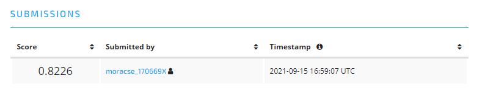
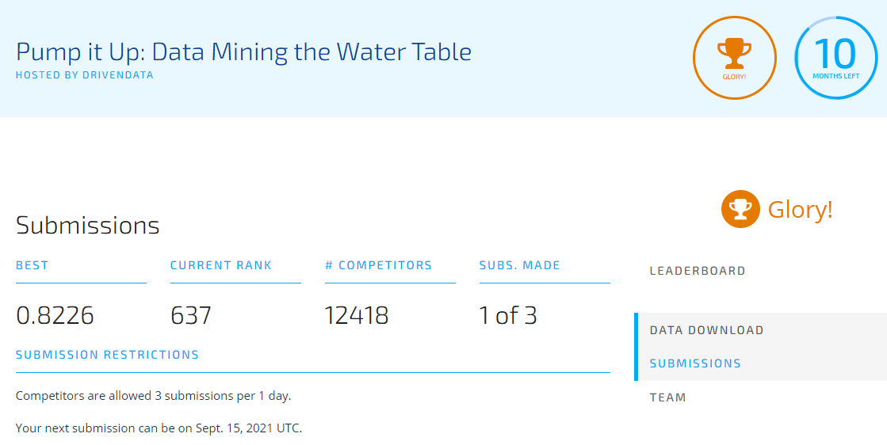

# Submission to "Pump it Up: Data Mining the Water Table" competition on DrivenData

## Preprocessing techniques

1. Imputed missing values in the following categorical columns with the most frequent value in each of them: `'funder', 'installer', 'subvillage', 'public_meeting', 'scheme_management', 'scheme_name', 'permit'`.
2. Replaced 0 values in `construction_year` with the earliest value of construction year.
3. Replaced `longitude` and `latitude` values of records whose `longitude` were below 30, with the **mean values of `longitude` and `latitude` when grouped by `region_code`**. The reason was that according to the GPS coordinates of Tanzania (`-6.3728253, 34.8924826`), longitude values must be at least over 30 (having a tolerance of 4). (Refer [here](https://latitude.to/map/tz/tanzania))
4. Replaced `date_recorded` values whose years were before `construction_year`, with the latest value of `date_recorded`.

## Feature Engineering techniques

1. Created a new feature called `age` representing how old a waterpoint is, by subtracting the year of `date_recorded` from `construction_year`.
2. Separated out year and month as `year_recorded` and `month_recorded` respectively, from `date_recorded`.
3. Excluded columns `id, date_recorded, recorded_by, num_private` from training features.
4. Applied Label Encoding on categorical features

## Submission statistics
### Submission #1
- Model: **Random Forest**
- Score: **0.8226**
- Rank: **637**
- Code: [here](https://github.com/bitRondo/MLProject/blob/master/DrivenData_PumpItUp_Disura_sub1.ipynb)
- Proof:

